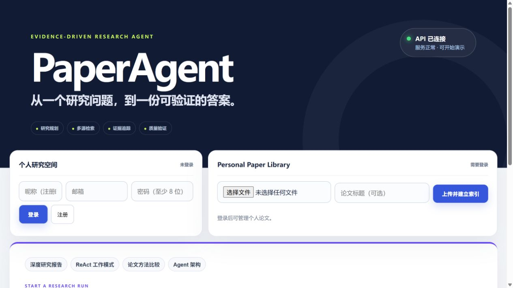
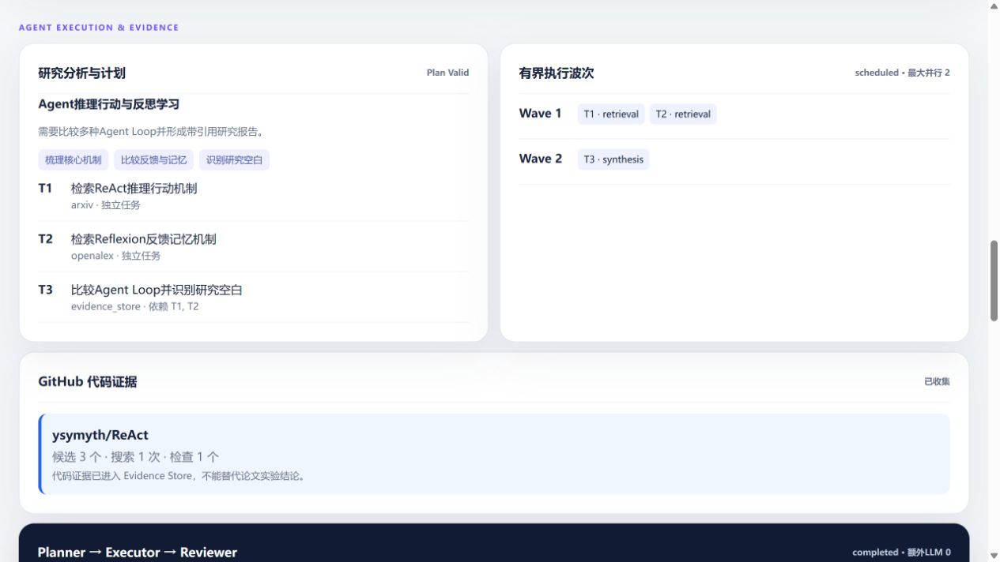
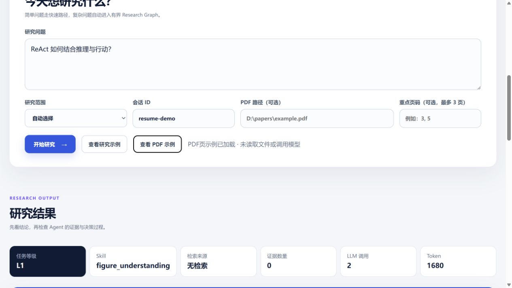

# PaperAgent：证据驱动的科研论文智能体

[](https://github.com/Fionaxxxi/paper-agent/actions/workflows/ci.yml)

PaperAgent 面向需要进行论文检索、方法比较、研究综述和 PDF 阅读的用户。它解决的不是“让大模型回答一个论文问题”，而是传统论文搜索结果分散、复杂调研依赖人工整理，以及通用 LLM 结论缺少可靠出处的问题。

系统能够将研究问题拆解为受控计划，联合个人论文库与公开学术数据源收集证据，在生成后检查引用、声明和 PDF 页码依据，最终输出可追溯的中文研究结论及 Word/PDF 报告。

> 完整架构、每层与每个模块、测试指标、性能数据、迭代记录和后续扩展统一维护在 [PaperAgent 项目完整说明书](docs/PAPERAGENT_PROJECT_MANUAL.md)。

## 项目成果

| 结果 | 当前实测 |
|---|---:|
| 最终回答内容质量 | 68.44 → **92.34**（+23.90） |
| 研究维度覆盖率 | 91.67% → **100%** |
| 关键事实覆盖率 | 56.25% → **78.12%** |
| 证据不足披露率 | 28.57% → **100%** |
| 引用准确率 / 证据可追溯率 | **100% / 100%** |
| 在线 LLM 核心能力集 | **29/30，96.67%** |
| 项目完整离线回归基线 | **422/422** |

最终回答质量来自 16 题真实模型 A/B：两边使用相同模型和相同冻结证据，Baseline 直接回答，PaperAgent 使用 Evidence Store、Research Writer 和验证链。完整研究链路平均 Token 增加 271.98%，因此只用于 L3 复杂研究任务。详见 [最终回答质量 A/B 报告](docs/ANSWER_QUALITY_AB_REPORT.md)。

## 核心能力

- **研究流程自动化：** 使用 LangGraph 将复杂问题组织为澄清、分级、规划、检索、证据覆盖、生成和验证节点；支持 L1/L2/L3 分级、有依赖子任务并行，以及最多一次 Replan 和 Reflection。
- **低成本系统路由：** 问候、身份和能力介绍由本地响应直接完成，即使是“你是？”“你好，介绍一下你能做什么”这样的省略或复合表达也不会进入论文流程；当前请求的文档、证据、工具、重试与 Token 指标会独立重置。
- **领域探索与术语理解：** 将 AIGC、SFT 等科研缩写展开为标准英文检索概念；“有什么可参考”等宽泛请求进入 L2 多源概览，分别检索代表方法、应用方向和评测安全，避免一次模糊搜索产生跨领域噪声。
- **Agent Harness 工程研究：** 将 Harness 映射为 Agent Scaffolding、Runtime、Evaluation Infrastructure 和 Workflow Orchestration，分别检索运行时、编排及工具治理证据；核心概念覆盖门阻止通用 Agent 论文冒充 Harness 证据。
- **语义校验缓存：** 在线论文缓存按查询和来源隔离，命中后仍检查核心概念覆盖；不匹配的缓存会自动穿透到论文源。Prompt Cache 等明确术语优先于通用 Agent 规则，并展开为 Prefix Caching、KV Cache 与 Inference Serving 查询。
- **混合知识检索：** 支持 Personal、Online、Hybrid 三种范围，联合个人 PDF 全文与 arXiv、OpenAlex、Crossref、Semantic Scholar；深度任务会从可信在线 PDF 下载全文、按页分块并定向召回方法/实验/局限证据，Local RAG 使用 BM25、MPNet Dense Retrieval、RRF 和置信度门控。
- **证据约束生成：** 统一 Evidence Store 保存论文身份、来源、页码和任务映射；Coverage、Citation、Claim-Evidence、PDF Grounding 和 Answer Verification 共同限制无依据结论。
- **论文多模态阅读：** 按问题自动选择关键页，通过 `qwen3.5-ocr` 提取架构图、实验表、曲线和公式信息，再由主模型结合 PDF 文本生成并验证回答。
- **记忆与个人知识：** 提供用户登录、Owner-scoped 个人论文库、论文卡片筛选、原始 PDF 在线预览、分页 Chunk 浏览与文内搜索；可从详情页选择“基于此论文提问”，让“这篇论文/它”等指代安全绑定当前文档。会话 Checkpoint、按需 Long-Term Memory RAG 和 Memory Write Gate 负责跨轮连续性，文件、正文和检索结果均按用户隔离。
- **工具与 MCP 治理：** Router、Registry、Policy、Executor 统一处理工具选择、参数、权限、超时、重试和错误；实现自建 Paper Catalog MCP，并提供只读 Zotero/GitHub 集成。
- **受控策略优化：** 从 Badcase 生成 Allowlist 内的 Prompt、Policy、Routing 或 RAG 候选；Promotion Gate 同时检查逐题回归、质量、安全、Token 和 P95 延迟，候选不能自动改代码或上线。

## 系统架构

```text
用户
├─ Web Research Console
├─ FastAPI / Swagger
└─ CLI
   ↓
PaperAgentService
├─ User / Session / Conversation
├─ Trace ID 与 PDF 输入校验
├─ 会话上下文 / Checkpoint
└─ AgentState 初始化
   ↓
LangGraph
├─ Intent Router
│  ├─ Smalltalk → 本地 0 LLM 回答
│  └─ 论文任务 → Clarification
├─ Research Analyzer → L1 / L2 / L3
├─ Memory Retrieval Gate
├─ Query Rewrite → Research Plan → Validator → Scheduler
├─ Retrieval Router
│  ├─ Online → Tool Router → Registry → Policy → Executor
│  │  ├─ arXiv / OpenAlex / Crossref / Semantic Scholar
│  │  └─ 深度任务 → 可信 PDF 下载缓存 → 全文分页 → 相关 Chunk 召回
│  ├─ Personal → Owner-scoped Local RAG
│  ├─ Hybrid → Personal + Online 有界并行
│  └─ PDF → 全文文本 + 关键页视觉证据
├─ Result Merge → Evidence Store → Coverage / Quality Gate
│  ├─ 证据足够 → 继续
│  ├─ 可修复 → 定向 Replan（最多 1 次）
│  └─ 仍不足 → 明确降级
├─ Skill Router → Research Writer
├─ Citation / Claim-Evidence / PDF Grounding / Answer Verification
├─ Answer Reflection（最多 1 次，必须已有修复证据）
├─ Memory Write Gate
└─ Metrics / Token / Latency / Tool Audit / Stop Reason
   ↓
中文回答 + 论文证据 + 执行轨迹 + Word/PDF 报告
```

复杂 L3 任务在同一状态图上形成 Planner → Executor → Reviewer 的有界角色交接；它不是多个自治模型自由讨论，角色编排本身不增加 LLM 调用。

## 界面预览

### 研究入口与个人论文库



### 研究结果与执行轨迹



### PDF 图表与页面视觉理解



## 技术设计

| 层 | 技术 | 职责 |
|---|---|---|
| Agent 编排 | LangGraph | 状态图、条件边、Checkpoint 和有界恢复 |
| 模型 | Qwen、LangChain OpenAI-compatible | 研究分析、生成与 PDF OCR |
| API | FastAPI、Pydantic、Uvicorn | HTTP 服务、请求响应契约和运行时 |
| 在线论文 | arXiv、OpenAlex、Crossref、Semantic Scholar | 论文发现与元数据补全 |
| Local RAG | BM25、FastEmbed、MPNet、ONNX Runtime、RRF | 词法/语义召回与置信路由 |
| Tool/MCP | Router、Registry、Policy、Executor、MCP stdio | 工具治理及外部复用 |
| 数据与记忆 | SQLite、文件缓存 | 用户、论文、会话、Checkpoint 和长期记忆 |
| PDF | pypdf、PyMuPDF、Qwen3.5-OCR | 全文、页码、关键页和视觉证据 |
| 评测 | Pytest、自研 Eval Harness | 回归、在线能力、RAG、A/B 和晋升门 |
| 交付 | HTML/CSS/JavaScript、Docker Compose、GitHub Actions | Web 展示、容器和基础 CI |

当前主模型默认配置为 `qwen3.7-max-2026-05-17`，视觉模型为 `qwen3.5-ocr`。

## 快速开始

### 1. 准备环境

```powershell
Set-Location D:\langgraphproject
conda activate paper_agent
python -m pip install -r requirements.txt
Copy-Item .env.example .env
```

在 `.env` 中至少配置：

```env
OPENAI_BASE_URL=https://dashscope.aliyuncs.com/compatible-mode/v1
OPENAI_API_KEY=你的百炼_API_Key
MODEL_NAME=qwen3.7-max-2026-05-17
RETRIEVAL_MODE=arxiv
PDF_VISION_ENABLED=false
PDF_VISION_MODEL_NAME=qwen3.5-ocr
```

OpenAlex 使用独立的可选凭据，不能使用百炼 API Key。`OPENALEX_MAILTO` 是礼貌池联系邮箱，不是密钥。

### 2. 启动 Web/API

```powershell
python -m uvicorn app.api:app --host 127.0.0.1 --port 8000
```

- Research Console：`http://127.0.0.1:8000/`
- Swagger：`http://127.0.0.1:8000/docs`
- 健康检查：`http://127.0.0.1:8000/health`

CLI：

```powershell
python main.py
```

### 3. Docker

```powershell
Copy-Item .env.example .env
docker compose up --build -d
docker compose ps
```

镜像不包含 `.env`、API Key、本地 PDF、模型缓存或 SQLite 数据。Compose 会挂载数据与日志目录。

## 推荐演示

### 零 API 完整流程

打开首页并选择“加载示例轨迹”，无需模型凭据即可展示 L3 Research Plan、Evidence Store、Coverage、Verification、节点耗时和工具记录。

### Personal + Online Hybrid

登录后上传个人 PDF，选择 Hybrid 范围，再运行：

```text
结合我收藏的 ReAct 论文和在线论文，比较 ReAct 与反思型 Agent 的架构和证据边界。
```

已完成的真实冒烟同时命中个人 PDF 与 arXiv，合并得到 8 条证据，总耗时 31.71 秒。详见 [Hybrid 冒烟报告](docs/HYBRID_SMOKE_REPORT.md)。

### PDF 图表分析

默认视觉关闭。用户确认图片可以发送到模型服务后，在 `.env` 开启：

```env
PDF_VISION_ENABLED=true
PDF_VISION_MODEL_NAME=qwen3.5-ocr
```

系统只处理明确指定或本地选出的关键页，一次最多 3 页。GraphRAG 论文第 4 页真实测试完成 2 次模型调用、7,549 Token，并通过 Figure Schema 与 PDF Grounding。详见 [PDF 视觉报告](docs/PDF_VISUAL_V2_REPORT.md)。

## 测试与评测

### 日常离线回归

```powershell
python -m pytest -q
```

生成包含“测试作用、通过含义、失败含义”的 JSON/CSV/JUnit 报告：

```powershell
python .\scripts\run_tests_with_report.py
```

### 在线 LLM 核心集

```powershell
powershell -ExecutionPolicy Bypass -File .\scripts\run_llm_online_eval.ps1
```

### 最终回答质量 A/B

以下命令会进行 32 次真实模型调用：

```powershell
powershell -ExecutionPolicy Bypass -File .\scripts\run_answer_quality_ab.ps1 -ConfirmOnline
```

复用已保存回答进行零 LLM 重判：

```powershell
powershell -ExecutionPolicy Bypass -File .\scripts\run_answer_quality_ab.ps1 `
  -InputReport outputs/answer_quality_ab/latest_answer_quality_ab.json
```

### 受控策略进化

```powershell
powershell -ExecutionPolicy Bypass -File .\scripts\run_evolution_cycle.ps1
```

该命令默认离线，只生成 Failure Dataset、候选、Scorecard 和 Promotion Gate 结果，不会自动修改源码或切换当前策略。

## 项目文档

| 文档 | 内容 |
|---|---|
| [项目完整说明书](docs/PAPERAGENT_PROJECT_MANUAL.md) | 完整架构、模块、测试、性能、迭代和路线 |
| [最终回答质量 A/B](docs/ANSWER_QUALITY_AB_REPORT.md) | 16题真实对照、指标口径和成本 |
| [架构模块逐流程详解](docs/ARCHITECTURE_MODULE_GUIDE.md) | 按实际执行顺序解释每个节点 |
| [项目面试题完整回答](docs/PROJECT_INTERVIEW_QA.md) | 与当前实现相关的 Agent/RAG/Memory/MCP 面试题 |
| [受控策略进化](docs/CONTROLLED_EVOLUTION.md) | Failure、Candidate、Gate 和 Registry |
| [PDF 视觉报告](docs/PDF_VISUAL_V2_REPORT.md) | 图、表、曲线和公式理解 |
| [发布核验清单](docs/RELEASE_CHECKLIST.md) | 发布状态、演示材料和剩余人工核验 |

## 当前边界

- 当前 Local RAG 是 BM25 + Dense + RRF，不是 GraphRAG 或 LightRAG。
- Multi-Agent 是 L3 中的有界角色交接，不是自由自治 Agent 集群。
- 受控进化只评估候选并等待人工审批，不会自动训练、改代码或上线。
- 登录与个人论文库是简历项目 MVP，不宣称具备生产级多租户安全与 SLA。
- 真实在线评测规模有限，结果用于项目版本对比，不能外推为所有研究问题准确率。
- Redis、PostgreSQL、向量数据库、GraphRAG/LightRAG 和更多数据源均为按评测选择的候选，不属于当前已实现能力。

## 项目定位

PaperAgent 的重点不是堆叠 Agent 名词，而是展示一条可运行、可解释、可验证的科研任务闭环：

```text
理解研究问题
→ 规划有限任务
→ 从私人和公开来源收集证据
→ 判断证据是否足够
→ 生成有出处的研究结论
→ 验证声明并有限恢复
→ 记录质量、成本和停止原因
```
